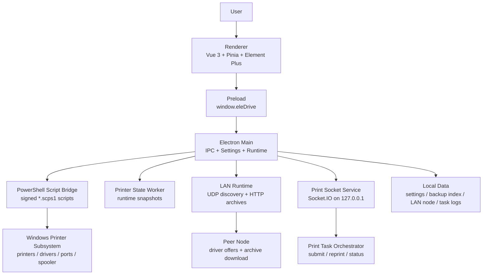

<div align="center">

<br/>

# Jarvis Print Manage

### Windows Printer Driver Maintenance Workbench

**为打印机驱动备份、恢复安装、局域网分发和本地打印服务而生的 Electron 工具**

<br/>


<br/>
<br/>

</div>

---

## Overview

**Jarvis Print Manage** 是一个面向 Windows 打印机维护场景的桌面工作台。它把系统打印机列表、驱动备份、驱动恢复、网络驱动安装和本地 Socket 打印服务收拢到一个可视化界面里，让运维人员不必在设备管理器、打印管理、PowerShell 和共享目录之间来回切换。

项目当前的产品名为 **虹色图文助手**。核心工作流围绕“先备份可用驱动，再在本机或局域网内恢复安装”展开，适合图文店、办公室、门店终端和需要批量维护打印机驱动的 Windows 环境。

> One printer list. Shared driver archives. Faster recovery.

<br/>

## Features

### Printer Workspace

- **已安装打印机视图**：读取本机打印机、端口、驱动、版本、厂商、系统 INF 和运行状态。
- **本地驱动视图**：按备份目录索引展示可恢复的驱动包，并提示当前安装状态。
- **网络驱动视图**：发现局域网节点提供的驱动备份，支持远程拉取并在本机安装。
- **操作菜单**：支持备份驱动、恢复安装、卸载打印机、重命名、打开属性、打开首选项和打印测试页。
- **安装向导**：恢复驱动时可设置显示名称；IP 端口类打印机可在安装前检测目标地址连通性。

### Driver Backup And Restore

- **驱动备份目录**：在系统设置中选择统一的驱动备份位置。
- **结构化备份索引**：备份结果包含打印机名、驱动名、版本、厂商、端口、硬件标识和 INF 路径等信息。
- **压缩包分发**：局域网传输使用驱动归档包，便于跨机器复制和安装。
- **PowerShell 脚本桥**：底层打印机操作由签名校验过的 `*.scps1` 脚本执行。
- **防误操作保护**：前端会根据当前备份、安装、卸载和状态同步过程禁用冲突操作。

### LAN Driver Sharing

- **UDP 节点发现**：局域网开启后，客户端通过广播发现同网段 Jarvis Print Manage 节点。
- **HTTP 驱动服务**：节点通过本地 HTTP 服务暴露可安装驱动列表和驱动归档下载接口。
- **任务状态同步**：网络安装任务会展示排队、发现节点、传输、安装、完成、失败和取消状态。
- **协议版本标识**：设置页显示当前局域网协议版本，便于排查客户端兼容性。
- **自动过滤已安装项**：网络驱动列表会隐藏本机已具备的同类驱动，减少重复安装。

### Local Print Service

- **Socket.IO 服务**：内置本机打印服务，默认监听 `127.0.0.1:17521`。
- **客户端信息**：外部系统可获取机器名、版本、架构和 Socket 协议版本。
- **打印机列表接口**：可通过 Socket 事件刷新并读取当前可用打印机。
- **任务编排**：内置打印任务 orchestrator，支持提交、查询、重打和状态更新。
- **渲染入口预留**：包含 `render-jpeg`、`render-pdf`、`render-print` 等事件入口。

### Settings And Runtime

- **主题模式**：支持亮色、暗色和跟随系统。
- **虚拟打印机过滤**：可配置名称、驱动和端口规则，屏蔽 PDF、XPS、OneNote 等虚拟设备。
- **系统托盘入口**：应用保留托盘导航能力，适合长期驻留。
- **单实例桌面壳**：Electron 主进程承载系统脚本、局域网运行时、打印服务和窗口生命周期。

<br/>

## Architecture



### Tech Stack

| Layer | Technology |
|-------|------------|
| Desktop Shell | Electron |
| Renderer | Vue 3 + Vite |
| State | Pinia |
| UI | Element Plus + IconPark |
| Native Bridge | Electron IPC + PowerShell |
| LAN Runtime | UDP discovery + Node.js HTTP server |
| Print Service | Socket.IO + local task orchestrator |
| Packaging | electron-builder + NSIS |

<br/>

## Project Structure

```text
jarvis-print-manage/
├── electron/
│   ├── main.cjs                 # Electron CJS loader
│   ├── main.mjs                 # Electron main process, IPC and runtime bootstrap
│   ├── preload.cjs              # Renderer IPC bridge exposed as window.eleDrive
│   ├── powershell.mjs           # Signed PowerShell script execution bridge
│   ├── lan/
│   │   └── runtime.mjs          # LAN discovery, offers, archive download and install tasks
│   ├── print-socket-service.mjs # Local Socket.IO print service
│   ├── print-task-orchestrator.mjs
│   ├── worker/
│   │   ├── printer-state.mjs    # Printer runtime state polling
│   │   └── print-render-task.mjs
│   ├── config/
│   │   └── script/ps/           # Printer PowerShell scripts and sign.json
│   └── resource/config/         # Runtime config templates
│
├── src/
│   ├── views/
│   │   ├── HomeView.vue         # Home dashboard
│   │   ├── PrintersView.vue     # Installed, local driver and network driver workspace
│   │   ├── DriverInstallView.vue
│   │   └── SettingsView.vue     # Theme, backup dir, LAN and virtual printer filters
│   ├── stores/runtime.js        # Pinia runtime state
│   ├── router/index.js
│   ├── theme.js
│   └── style.css
│
├── scripts/
│   ├── dev-free-port.mjs
│   ├── check-lan-share.ps1
│   └── fix-lan-share.ps1
│
├── .github/workflows/release.yml
├── package.json
├── package-lock.json
└── vite.config.js
```

<br/>

## PowerShell Script Registry

Printer operations are implemented through scripts under `electron/config/script/ps`.

| Script | Purpose |
|--------|---------|
| `printer-list-installed.scps1` | Read installed printers, drivers and spooler fallback state |
| `printer-runtime-state.scps1` | Poll live printer status for UI updates |
| `printer-backup-driver.scps1` | Export driver files and generate backup metadata |
| `printer-archive-create.scps1` | Package a driver backup into an archive |
| `printer-archive-extract.scps1` | Extract a received driver archive |
| `printer-install-from-backup.scps1` | Install a printer from backup metadata |
| `printer-uninstall.scps1` | Remove printer, driver and residual files when possible |
| `printer-ping-host.scps1` | Check IP reachability before network printer install |
| `printer-print-test-page.scps1` | Send a Windows printer test page |
| `printer-open-properties.scps1` | Open printer properties |
| `printer-open-preferences.scps1` | Open printer preferences |
| `printer-open-system-add-wizard.scps1` | Open the Windows add-printer wizard |

`sign.json` stores script hashes. The main process verifies script integrity before execution so that changed scripts are not silently run.

<br/>

## Development

### Prerequisites

- Node.js 20+
- npm 10+
- Windows desktop environment with printer management permissions
- PowerShell available on the host machine

### Run Locally

```bash
# clone
git clone https://github.com/jarvis-workbench/jarvis-print-manage.git
cd jarvis-print-manage

# install dependencies
npm install

# start Vite and Electron
npm run dev
```

Development mode starts:

| Process | Command | Description |
|---------|---------|-------------|
| Renderer | `vite` | Vue renderer development server |
| Electron | `electron .` | Desktop app connected to the Vite dev server |
| Port helper | `node scripts/dev-free-port.mjs` | Frees the default Vite port before launch |

### Build

```bash
# build renderer only
npm run build:web

# build renderer and package Windows installer
npm run build
```

Packaged artifacts are written to `release/`.

<br/>

## GitHub Build

The project follows the release workflow style used by [jarvis-browser](https://github.com/jarvis-workbench/jarvis-browser), adapted for this Windows printer management app.

- Workflow: `.github/workflows/release.yml`
- Manual trigger: `workflow_dispatch`
- Tag trigger: `v*`
- Current CI target: `windows-latest`
- Dry-run artifacts: uploaded as `jarvis-print-manage-windows-latest`

Run manually with GitHub CLI:

```bash
gh workflow run release.yml \
  --repo jarvis-workbench/jarvis-print-manage \
  --ref master \
  -f publish=false
```

Create a release build by pushing a version tag:

```bash
git tag v0.1.0
git push origin v0.1.0
```

The current build is an unsigned Windows preview package. Windows may show a security warning during installation or first launch.

<br/>

## Core Concepts

| Concept | Meaning |
|---------|---------|
| Installed Printer | Windows 当前已安装并可读取到的打印机 |
| Local Driver | 已在备份目录中保存、可用于恢复安装的驱动 |
| Network Driver | 局域网其他节点通过 Jarvis Print Manage 暴露的驱动备份 |
| Driver Archive | 用于局域网传输的驱动备份压缩包 |
| LAN Node | 同网段中开启局域网组网的客户端 |
| LAN Offer | 某个节点提供的可安装驱动条目 |
| Print Socket Service | 面向本机外部系统的 Socket.IO 打印服务 |
| PowerShell Script Bridge | Electron 主进程调用 Windows 打印管理脚本的执行层 |

<br/>

## Repository

- GitHub: [jarvis-workbench/jarvis-print-manage](https://github.com/jarvis-workbench/jarvis-print-manage)
- Organization: [jarvis-workbench](https://github.com/jarvis-workbench)
- Reference: [jarvis-workbench/jarvis-browser](https://github.com/jarvis-workbench/jarvis-browser)

<br/>

## License

No license has been published yet.

<br/>

---

<div align="center">

**Jarvis Print Manage** - A focused Windows printer driver maintenance workspace.

<sub>Built with Electron · Vue 3 · Vite · Pinia · Element Plus</sub>

</div>
