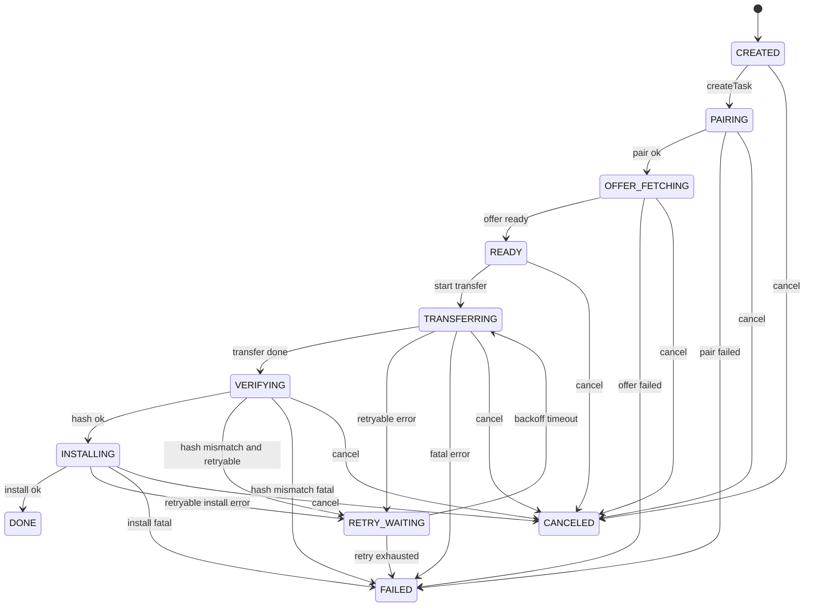

# 设计：局域网任务状态机时序图（P2/P3）

更新时间：2026-03-28  
状态：已确认（联调与开发共用基线）  
关联文档：
- `docs/planning/00002-lan-network-sharing/00004-IPC与数据契约草案.md`
- `docs/planning/00002-lan-network-sharing/00007-传输失败重试与降级策略.md`
- `docs/planning/00002-lan-network-sharing/00008-功能逐文件编码清单.md`

## 1. 目标
- 将 `LanTask` 状态流转固化为可执行时序，避免 main/worker/renderer 对状态理解不一致。
- 统一“可重试失败”和“不可重试失败”的分叉入口，保证日志回放一致。

## 2. 状态定义（首版）
- `CREATED`：任务已创建，等待节点校验。
- `PAIRING`：配对码校验与白名单检查中。
- `OFFER_FETCHING`：远端能力拉取中。
- `READY`：满足安装前置条件，等待传输。
- `TRANSFERRING`：压缩包传输中。
- `VERIFYING`：哈希校验中。
- `INSTALLING`：调用本地安装链路中。
- `DONE`：安装成功。
- `RETRY_WAITING`：可重试失败，等待退避后重试。
- `FAILED`：不可恢复或重试耗尽。
- `CANCELED`：用户取消或系统中断取消。

## 3. 任务主时序（Mermaid）

## 4. 事件与状态回填约束
- 每次状态变化必须记录：
  - `taskId`
  - `fromState`
  - `toState`
  - `attempt`
  - `errorCode`（无则空字符串）
  - `ts`
- `attempt` 仅在进入 `TRANSFERRING` 前递增，其他状态不递增。
- `CANCELED` 一旦写入不可再迁移到其他状态。

## 5. 重试分叉规则
- 进入 `RETRY_WAITING` 的前提：错误码命中可重试集合（见 `10` 文档）。
- `RETRY_WAITING` 退避完成后仅回到 `TRANSFERRING`，不回跳 `PAIRING/OFFER_FETCHING`。
- 达到最大重试次数后，统一写入 `FAILED` 且 `errorCode=LAN_RETRY_EXHAUSTED`。

## 6. 实现映射建议
- `electron/main.mjs`：状态写入、任务注册、IPC 查询。
- `electron/worker/lan-transfer.mjs`：传输/校验/安装事件上报。
- `src/stores/runtime.js`：轮询或订阅任务状态，按状态机驱动 UI。

## 7. 验收点
- 同一 `taskId` 在日志中不存在非法跳转（例如 `CREATED -> INSTALLING`）。
- 可重试失败路径必须包含 `RETRY_WAITING`，不可重试失败不得出现 `RETRY_WAITING`。
- UI 展示状态集合与本文件定义完全一致。

